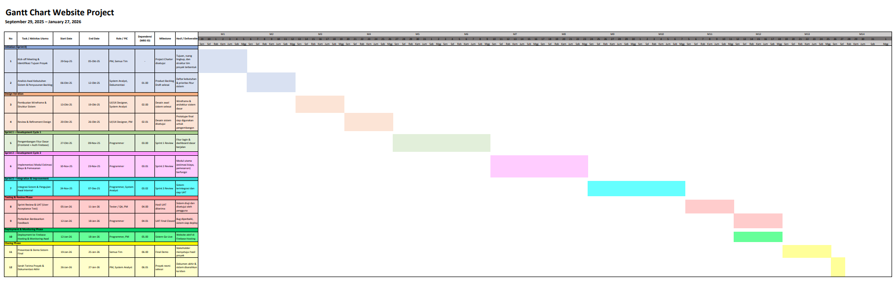
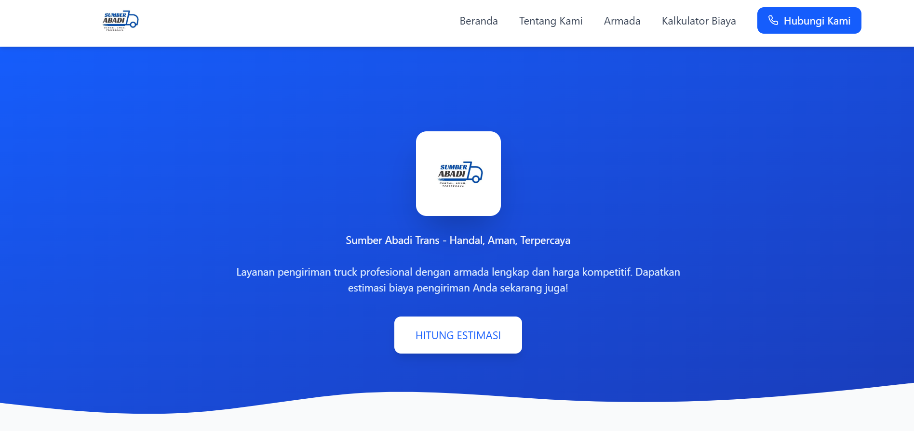
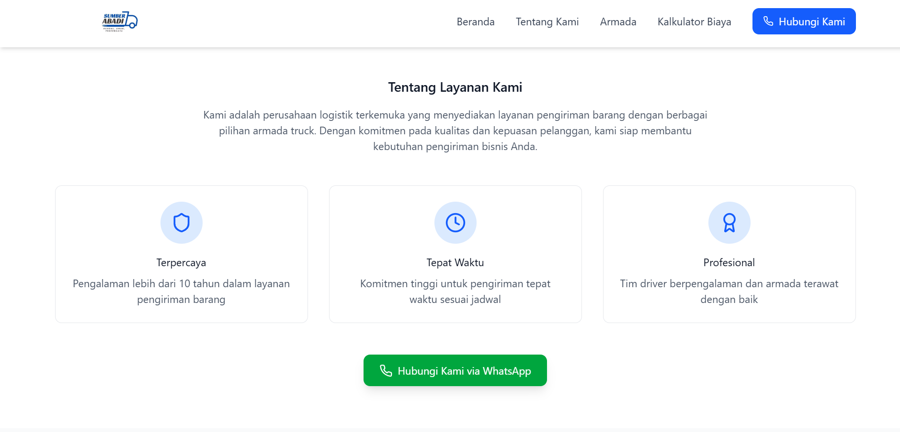
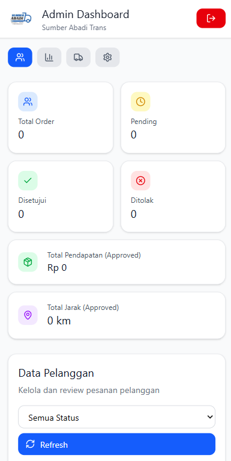

# 🚍 Sumber Abadi Trans — Website Development Project

---

# 📌 Project Overview

This project is a website development initiative for **Sumber Abadi Trans**, created as part of the *Perencanaan dan Pengembangan Sistem Informasi (PPSI)* course at Universitas Gunadarma.

The objective of this project is to develop a **company profile website** that provides information about transportation services while strengthening the company's digital presence.

The project follows the **System Development Life Cycle (SDLC)** methodology which includes planning, analysis, system design, development, testing, and deployment.

---

# 👨‍💼 My Role — Project Manager

In this project, I served as the **Project Manager**, responsible for planning and coordinating the entire development process.

### Key Responsibilities

- Developed the **project planning and development timeline**
- Created and managed the **Gantt Chart for project scheduling**
- Coordinated task distribution among team members
- Managed **project milestones and deliverables**
- Monitored development progress throughout the project
- Ensured the project was completed according to the planned schedule

---

# ⏳ Project Duration

**September 2025 — January 2026**

---

# 📊 Project Timeline

The following **Gantt Chart** was used to manage project activities and scheduling.

  

The Gantt Chart helped the team to:

- Organize project activities  
- Identify task dependencies  
- Monitor milestones and progress  
- Ensure on-time project completion  

---

# 🖥 Website Preview

Below are several previews of the website interface.

  
  
  

### Main Features

The website provides several key features including:

- 🏢 **Company Profile**  
- 🚌 **Transportation Service Information**  
- 📄 **Service Details**  
- 📞 **Contact Information**

---

# 🛠 Technologies Used

The technologies used in this project include:

- **React.js**
- **TypeScript**
- **HTML5**
- **CSS3**
- **Node.js**
- **GitHub** for version control

---

# 👥 Team Structure

This project was developed collaboratively as part of a university group project.

Project Role Distribution:

# 👥 Team Structure

This project was developed by a team of three members.

| Role | Responsibility |
|-----|-----|
| **Project Manager (Daffa Al Fansyah)** | Project planning, timeline management, and team coordination |
| **Developer (Alexandro Gymnastiar)** | Website development and feature implementation |
| **Design & Testing (Zhafira)** | UI design, wireframing, and system testing |

---

# 🚀 Key Skills Demonstrated

This project demonstrates several technical and project management skills:

- Project Management  
- System Analysis  
- Requirement Planning  
- Timeline & Milestone Management  
- Team Coordination  
- System Development Life Cycle (SDLC)
